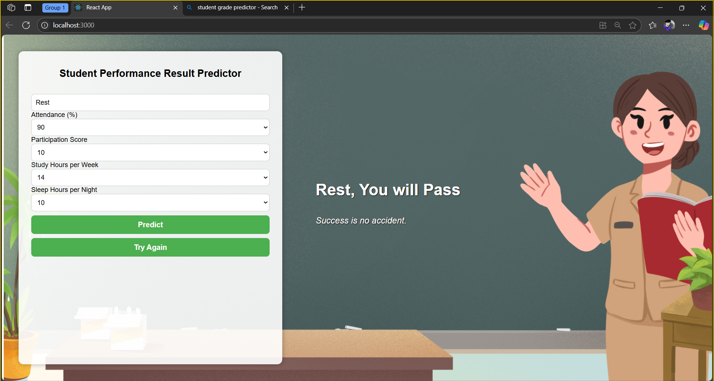
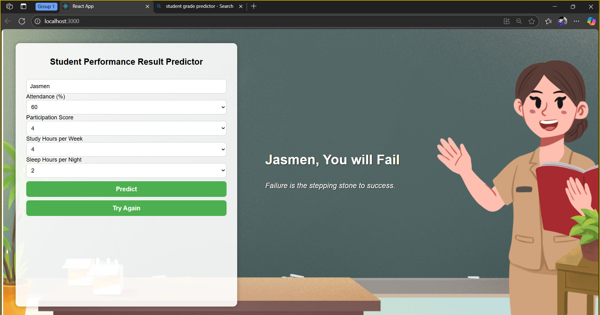

# React Frontend – AI-Powered Academic Performance Predictor

This folder contains the **React-based frontend UI** for the **AI-Powered Academic Performance Predictor** chatbot.  
It manages the user interface, user input, and the display of responses from a working AI-driven chatbot system.

## UI Preview (Working Chatbot)

The images below serve as **visual proof of a functional chatbot interface**, showing what the application looks like while the chatbot is running and responding correctly.

### Chatbot Interface – View 1

### Chatbot Interface – View 2

## Description

This frontend is built using **React** and is designed to work together with a backend service.  
The displayed interfaces confirm that the chatbot is operational and capable of real-time interaction and academic performance prediction.

The application **cannot run as a standalone deployed site** and is intended to be accessed **only through localhost** during development, as it depends on a locally running backend API.

## How It Runs

- Runs on `localhost` (e.g., `http://localhost:3000`)
- Requires a locally running backend server
- Intended for development, testing, and project-based use

## Notes

- Ensure **Node.js** is installed
- Install dependencies:

npm install

- Start the development server:

npm start

Once started, the chatbot UI can be accessed through your browser via localhost.
